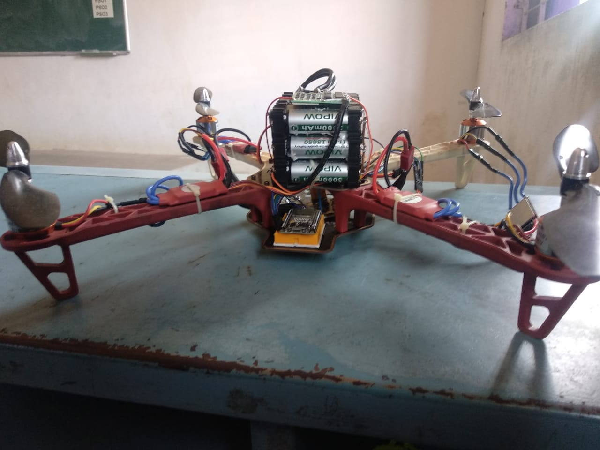
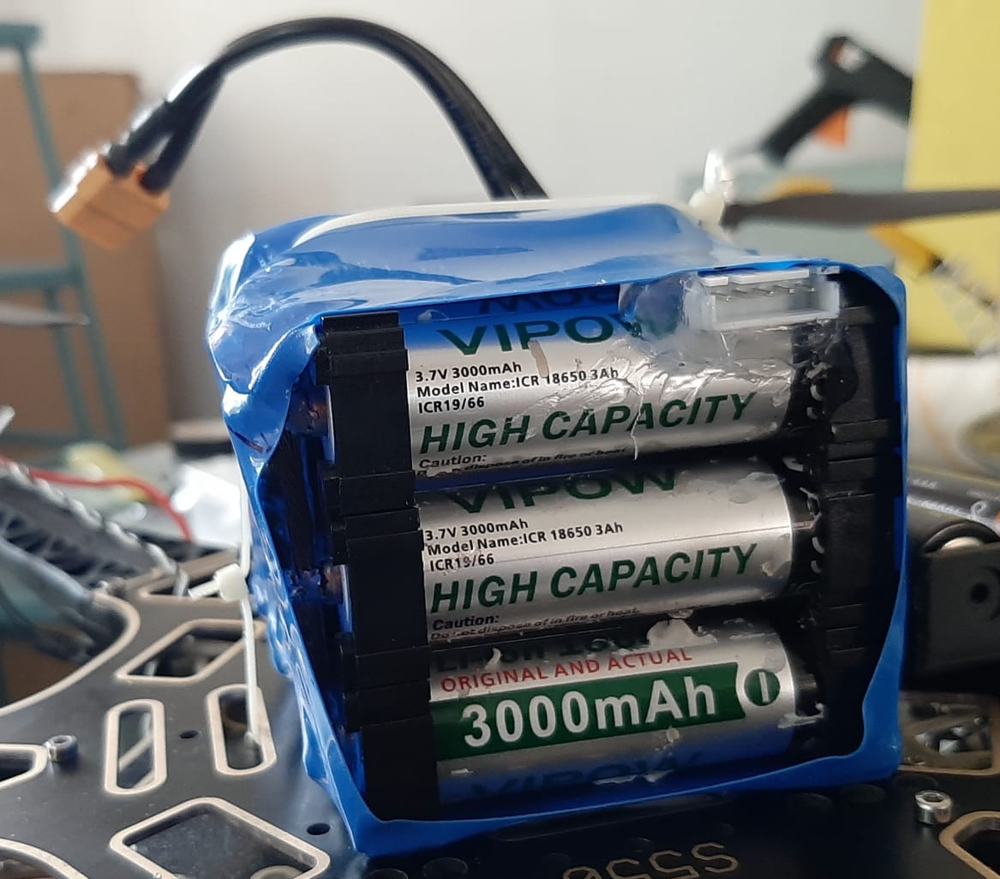
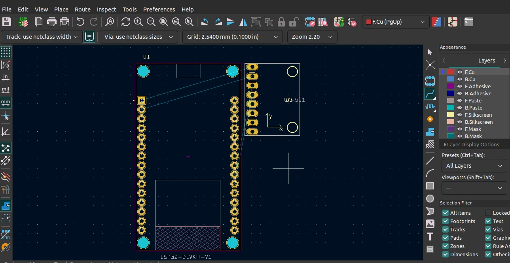
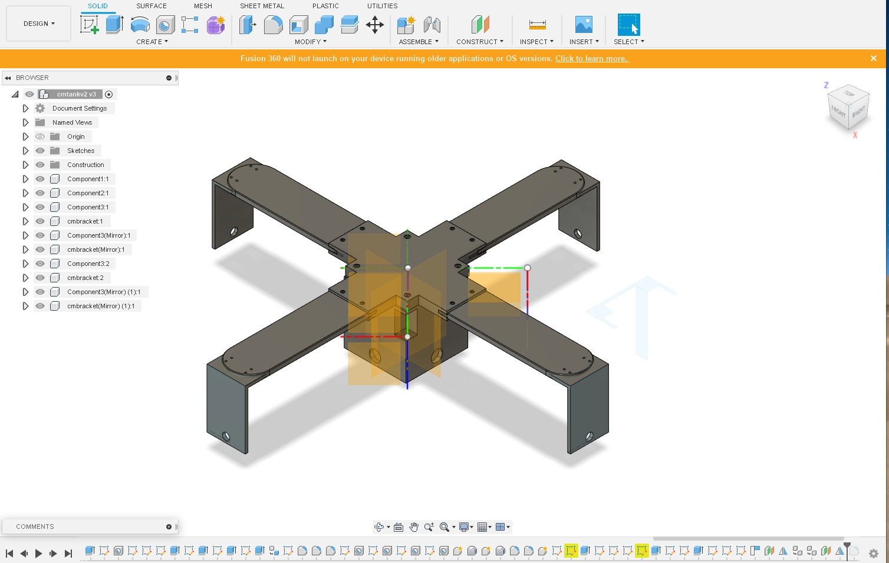

# OmniDrone Flight Control System

A sophisticated flight control system for an omni-directional drone using ESP32 microcontroller, featuring advanced stabilization, altitude hold, and safety features.

## Hardware Components

### Core Components
- **Flight Controller**: ESP32 Development Board
- **IMU**: MPU6050 (Gyroscope + Accelerometer)
- **Radio**: NRF24L01 2.4GHz Transceiver
- **Altitude Sensor**: LightWare LW20/C LIDAR
- **Battery Monitor**: MAX17043 Fuel Gauge
- **Motors**: 4x Brushless DC Motors
- **ESCs**: 4x DShot600-compatible Electronic Speed Controllers (ESCs)

### ESC Protocol
This project currently only supports DShot600 protocol for ESC communication. The implementation uses the ESP32's RMT (Remote Control) peripheral for precise timing control, based on the excellent DShotRMT library by derdoktor667.

DShot600 Specifications:
- Bitrate: 600kbit/s
- Bit timing: 1.67µs per bit
- Frame time: 26.72µs
- Signal timing:
  - Bit 1: 1.25µs high, 0.625µs low
  - Bit 0: 0.625µs high, 1.25µs low


#### ESP32 Connections

| Component | ESP32 Pin | Description |
|-----------|-----------|-------------|
| **MPU6050** |
| SDA | GPIO 21 | I²C Data |
| SCL | GPIO 22 | I²C Clock |
| VCC | 3.3V | Power |
| GND | GND | Ground |
| **NRF24L01** |
| CE | GPIO 4 | Chip Enable |
| CSN | GPIO 5 | Chip Select |
| MOSI | GPIO 23 | SPI MOSI |
| MISO | GPIO 19 | SPI MISO |
| SCK | GPIO 18 | SPI Clock |
| VCC | 3.3V | Power |
| GND | GND | Ground |
| **LightWare LW20/C** |
| TX | GPIO 16 | UART RX |
| RX | GPIO 17 | UART TX |
| VCC | 5V | Power |
| GND | GND | Ground |
| **MAX17043** |
| SDA | GPIO 21 | I²C Data  |
| SCL | GPIO 22 | I²C Clock |
| VCC | 3.3V | Power |
| GND | GND | Ground |
| **ESCs** |
| Motor1 | GPIO 25 | Front Right Motor |
| Motor2 | GPIO 26 | Front Left Motor |
| Motor3 | GPIO 27 | Rear Left Motor |
| Motor4 | GPIO 33 | Rear Right Motor |

## Quick Start Guide for Beginners

### Testing Motors with Arduino IDE
Before diving into the full flight control system, you can test your hardware setup using our simple motor test sketch.

1. **Hardware Setup**
   - Connect your ESP32 to your computer
   - Wire the ESCs to the following pins:
     - Motor1 (Front Right): GPIO 25
     - Motor2 (Front Left): GPIO 26
     - Motor3 (Rear Left): GPIO 27
     - Motor4 (Rear Right): GPIO 33
   - Connect ESC power to a suitable battery/power supply

2. **Software Setup**
   - Install Arduino IDE
   - Install ESP32 board support
   - Download and install the DShotRMT library
   - Open `tutorial/DShot_Motor_Test.ino`

3. **Testing Procedure**
   - Upload the sketch to your ESP32
   - Open Serial Monitor (115200 baud)
   - Use the following commands:
     - `motor,speed` (e.g., "1,50" sets motor 1 to 50% speed)
     - `0,0` stops all motors
   - Test each motor individually to verify:
     - Proper connections
     - Correct rotation direction
     - Smooth throttle response

4. **Safety Notes**
   - Remove propellers during initial testing
   - Keep fingers away from motors
   - Have a way to quickly disconnect power
   - Start with low throttle values (10-20%)

This test provides a simple way to verify your hardware setup before proceeding with the full flight control implementation. 

## Software Architecture

### Core Systems

1. **Flight Control**
   - PID controllers for roll, pitch, yaw, and altitude
   - Multiple flight modes including manual and altitude hold
   - Safety features and failsafe mechanisms

2. **Sensor Integration**
   - MPU6050 for attitude estimation
   - LightWare LW20/C for precise altitude measurements (0.2-50m range)
   - MAX17043 for battery monitoring

3. **Communication**
   - Bidirectional telemetry
   - Control input processing
   - Fail-safe communication monitoring

### Flight Modes

1. **Normal Operation**
   - Full manual control
   - Real-time attitude stabilization

2. **Altitude Hold**
   - Maintains specified altitude using LIDAR
   - Allows focus on horizontal movement

3. **Safety Modes**
   - Warning Low Battery: Limited performance
   - Return to Home: Automated return (requires GPS, not implemented)
   - Emergency Landing: Controlled descent
   - Failsafe: Emergency motor stop

## Building and Flashing

1. **Prerequisites**
   ```bash
   # Required libraries
   - ESP32Servo
   - MPU6050
   - RF24
   - LightWare_LW20
   - MAX17043
   ```

2. **Build Process**
   ```bash
   mkdir build
   cd build
   cmake ..
   make
   ```

3. **Flashing**
   ```bash
   # Using esptool
   esptool.py --port /dev/ttyUSB0 write_flash 0x10000 OmniDrone.bin
   ```

## Safety Features

1. **Battery Management**
   - Real-time voltage monitoring
   - Multiple warning thresholds
   - Automatic landing on critical battery

2. **Motor Safety**
   - Gradual throttle changes
   - Emergency stop capability
   - Motor failure detection

3. **Communication Safety**
   - Signal loss detection
   - Automatic failsafe activation
   - Telemetry monitoring

## Calibration and Setup

1. **ESC Calibration**
   - Power on with zero throttle
   - Wait for ESC initialization beeps
   - System automatically sets proper PWM range

2. **Sensor Calibration**
   - MPU6050 auto-calibrates on startup
   - Place drone on level surface during boot
   - Allow 5 seconds for gyro calibration

3. **Radio Setup**
   - Verify NRF24L01 addresses match between transmitter and receiver
   - Test range before flight
   - Verify failsafe behavior

## Operation Guidelines

1. **Pre-flight Checks**
   - Battery voltage above 30%
   - All sensors reporting valid data
   - Motors responding to input
   - Radio link established

2. **Flight Controls**
   - Throttle: Vertical movement
   - Roll: Left/Right tilt
   - Pitch: Forward/Backward tilt
   - Yaw: Rotation
   - Altitude Hold: Automatic height maintenance

3. **Emergency Procedures**
   - Low battery: Land immediately
   - Signal loss: Automatic landing
   - Sensor failure: Switch to manual mode
   - Critical failure: Emergency stop

## Troubleshooting

Common issues and solutions:

1. **Unstable Flight**
   - Check PID tuning parameters
   - Verify sensor readings
   - Check propeller balance

2. **Communication Issues**
   - Verify NRF24L01 connections
   - Check radio channel settings
   - Verify antenna orientation

3. **Sensor Errors**
   - Check I²C connections
   - Verify power supply stability
   - Check for interference sources


## Project Gallery

 

  
## Contributing

Feel free to contribute to this project by:
1. Reporting issues
2. Suggesting enhancements
3. Creating pull requests

## License

This project is licensed under the MIT License - see the LICENSE file for details. 

## Acknowledgments
Special thanks to:
- derdoktor667 for the [DShotRMT library](https://github.com/derdoktor667/DShotRMT), which provides the foundation for our ESC communication implementation
- The ESP32 community for their extensive documentation and support 

### Altitude Sensing
The LightWare LW20/C LIDAR provides:
- Range: 0.2m to 50m
- Update Rate: up to 388 readings per second
- Accuracy: ±0.1m
- Serial Interface: 3.3V TTL UART
- Supply Voltage: 5V DC
- Low power consumption: 100mA (typical)

